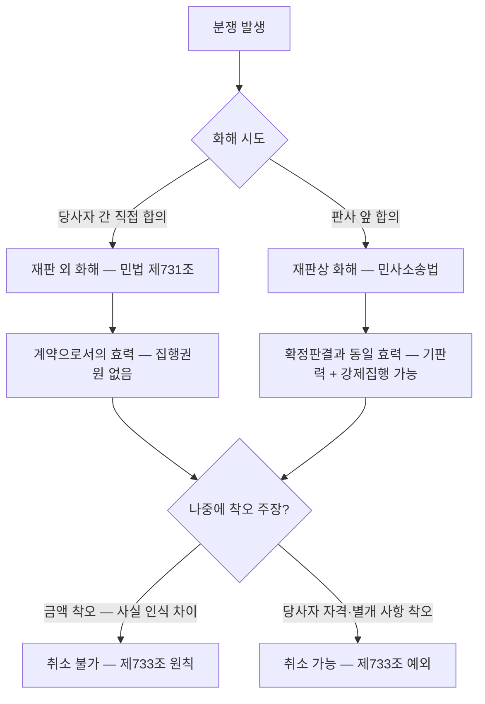

# 화해(和解)

## 개요

화해(和解)는 당사자가 **상호 양보**하여 그들 사이의 분쟁을 종지할 것을 약정함으로써 성립하는 계약이다(「민법」 제731조). 소송에 갈음하는 분쟁해결 수단으로, 공공조달에서는 하자보수, 지체상금, 계약금액 분쟁 등을 법원 외에서 해결할 때 활용된다. 화해 자체가 계약의-성립|청약과 승낙으로 성립하는 계약이므로 민법 총칙의 계약 일반 규정이 적용되지만, 착오 취소에 대해서는 특별 규정(제733조)이 있다.

> [!note] 왜 화해계약에서 착오를 이유로 취소하지 못하게 하는가?
> 화해의 본질은 **불확실한 분쟁을 확정**하는 것이다. 당사자가 서로 양보하여 권리·의무 관계를 새로 설정했는데, 나중에 "잘못 알았다"는 이유로 뒤집을 수 있다면 화해는 분쟁 해결 수단으로서 기능하지 못한다. 제733조는 화해의 **법적 안정성**을 보장하기 위한 규정이다. 분쟁 당사자가 양보를 각오하고 합의했다면, 사후에 불리하다고 느껴도 그 결과를 감수해야 한다는 것이 입법 취지다.

## 현행 규정

### 종류 비교

| 구분 | 재판 외 화해 | 재판상 화해 |
|------|------------|-----------|
| 근거 | 「민법」 제3편 제2장 제15절 | 민사소송법 |
| 절차 | 당사자 간 직접 합의 | 판사 앞에서 합의, 화해조서 작성 |
| 효력 | 계약으로서의 효력 | 확정판결과 동일한 효력(기판력) |
| 집행권원 | 없음 (별도 소송 필요) | 화해조서로 강제집행 가능 |
| 통칭 | '민사상 합의'와 대체로 동일 | '합의조서' 또는 '화해조서' |

> [!info] 재판 외 화해와 '합의'의 관계
> 원본 교재에 따르면, "흔히 말하는 '민사상 합의'와 대체로 같은 의미이다. 다만 보통 '합의'라고 하면 민·형사상 합의를 지칭할 때가 많으므로, 민법상 화해보다는 합의가 좀 더 개념범위가 넓다"고 설명한다. 공공조달 실무에서는 분쟁 당사자가 서면 합의서를 작성하는 형태가 재판 외 화해에 해당한다.

### 창설적 효력(創設的 效力) (제732조)

화해계약은 **창설적 효력**을 가진다. 즉:
- 당사자 일방이 양보한 권리는 **소멸**
- 상대방은 화해로 인해 그 권리를 **새로 취득**

→ 원래 권리 관계가 어떠했는지와 **무관하게** 화해 내용이 새로운 법적 기준이 된다.

> [!note] 창설적 효력의 실무 의미
> 대법원은 재판상 화해의 창설적 효력에 대해, "화해가 이루어지면 종전의 법률관계를 바탕으로 한 권리의무관계는 소멸하고 화해 내용이 새로운 권리의무의 기준이 된다"고 판시했다(대법원 99다17319). 단, 창설적 효력은 당사자가 서로 양보하여 확정하기로 합의한 사항에만 미치며, 다툼이 없었던 사항이나 화해의 전제로서 양해한 사항에는 적용되지 않는다.

### 착오와 화해 (제733조)

화해계약은 **착오(錯誤)를 이유로 취소하지 못한다.**

단, 다음 경우는 예외:
- 화해 당사자의 **자격**에 착오가 있는 경우
- 분쟁 이외의 **별개 사항**에 착오가 있는 경우

→ 금액을 잘못 산정했다거나, 사실 관계에 대한 인식이 달랐다는 이유로는 취소 불가.

> [!info] '분쟁 이외의 사항'이란?
> 판례에 따르면, "화해의 목적인 분쟁 이외의 사항"이란 분쟁의 대상이 아니라 분쟁의 **전제 또는 기초가 된 사항**으로서 쌍방 당사자가 예정한 것이어서 상호 양보의 내용으로 되지 않고 다툼 없이 양해된 사항을 의미한다. 예를 들어, 화해 당시 계약자와 발주기관이 모두 같은 회사로 알고 합의했는데 실제로는 다른 법인이었다면(당사자 자격 착오) 취소 가능하다.

## 적용 조건

- 당사자 간 분쟁이 존재하고 **상호 양보**가 있어야 화해 성립
- 일방만 양보하는 것은 화해가 아니라 채무 면제 또는 포기
- 재판상 화해는 소송 계속 중 또는 소 제기 전 조정 신청 등을 통해 성립

## 실무 적용

공공조달에서 화해가 활용되는 주요 상황:

| 분쟁 유형 | 화해 활용 방식 |
|----------|--------------|
| 하자보수보증금-납부비율\|하자보수 범위 분쟁 | 하자 인정 범위와 보수 금액을 상호 양보하여 합의 |
| 지체상금 감액 분쟁 | 지체 귀책 사유 다툼 → 지체상금 일부 감면으로 합의 |
| 계약금액 조정 분쟁 | 물가변동-계약금액조정-조건\|물가변동·설계변경-계약금액-조정기준\|설계변경 금액 산정 이견 → 절충금액으로 합의 |
| 계약의-해제와-해지\|계약 해지 위약금 분쟁 | 위약금 규모 다툼 → 감액 합의로 분쟁 종결 |

> [!example] 지체상금 화해 사례
> 공공 건설 공사에서 준공이 60일 지연된 경우, 발주기관은 전체 60일분 지체상금을 청구하고 계약자는 30일은 발주기관 귀책(설계변경 지시 지연)이라고 주장하며 다툼이 발생했다. 소송으로 가면 수년이 걸릴 수 있어, 쌍방이 40일분 지체상금을 지급하는 것으로 재판 외 화해를 체결하였다. 이후 계약자가 "지체 귀책 산정을 잘못했다"며 취소를 주장했으나, 법원은 민법 제733조에 따라 취소 불가 판단을 내렸다.

> [!example] 대법원 99다17319 — 창설적 효력의 범위
> 대법원은 화해계약의 창설적 효력이 "당사자가 서로 양보하여 확정하기로 합의한 사항"에만 미친다고 제한 해석했다. 화해 당시 전제로 삼았던 사항(예: 하자 존재 자체에 대한 합의 없이 보수 금액만 합의)은 창설적 효력 범위 밖이므로, 나중에 하자 존재 여부를 다시 다툴 수 있다는 취지. 공공조달 화해 시 합의 범위를 명확히 특정해야 한다는 실무 교훈을 남겼다.

> [!warning] 시험 함정 및 실무 주의사항
> - 화해는 **일방의 양보만으로는 성립하지 않는다** — 채무 면제·포기와 구별할 것.
> - 재판 외 화해는 집행권원이 없다 — 상대방이 합의 내용을 이행하지 않으면 별도 소송이 필요하다.
> - **금액 산정 착오는 취소 사유가 아니다** — 화해 전 정확한 손익 계산이 필수.
> - 재판상 화해는 확정판결과 동일한 효력 — 이의 제기 수단이 매우 제한적이다.
> - [[공공계약-변경-분쟁해결-절차]]에서 분쟁조정위원회 조정안 수락도 화해와 유사한 효력을 가지지만, 민법상 화해계약과는 구별된다.

## 시험 출제 포인트

- **제731조** = 상호 양보 + 분쟁 종지 약정 → 화해 성립
- **제732조** = 창설적 효력 (기존 권리 소멸, 새 권리 발생)
- **제733조** = 착오로 취소 불가 원칙 / 예외: 당사자 자격 착오 또는 분쟁 이외 사항 착오
- 재판 외 화해 vs 재판상 화해: **기판력·강제집행 가능 여부**가 핵심 차이

## 관련 카드

- [[계약의-해제와-해지]] — 화해 없이 분쟁이 심화될 경우의 계약 종료 경로
- [[계약의-성립]] — 화해 자체도 청약·승낙으로 성립하는 계약
- [[도급과-위임의-구별]] — 하자 분쟁·지체상금 분쟁에서 화해가 활용되는 계약 유형
- [[공공계약-변경-분쟁해결-절차]] — 조달 분쟁의 공식 절차 경로 (화해는 비공식 대안)
- [[하자보수보증금-납부비율]] — 화해가 자주 활용되는 하자 분쟁의 제도적 배경
