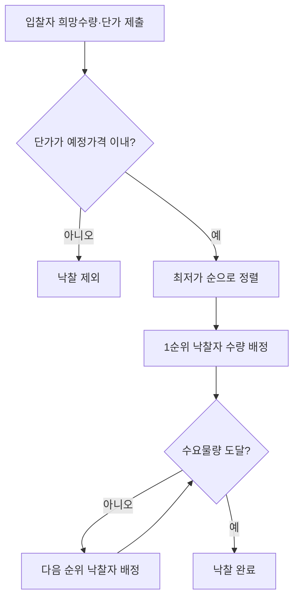

# 희망수량경쟁입찰

## 개요

다량의 수요물품을 제조 또는 구매할 때 1인의 공급 능력이 부족하거나, 다수 공급자와 분할 계약하는 것이 국가에 유리한 경우에 적용하는 입찰 방식이다. 입찰자는 **희망수량**과 **단가**를 함께 제시하며, 낙찰자 선정은 최저가 순으로 수요물량이 충족될 때까지 진행된다.

> [!note] 왜 이 방식이 필요한가?
> 군용 피복·의약품·연료 같은 대량 동일물품은 한 업체가 전량 공급하기 어렵고, 단일 공급자에게 의존하면 수급 리스크가 커진다. 희망수량경쟁입찰은 **복수 낙찰을 제도화**함으로써 공급 안정성을 높이고, 최저가 순 선발로 예산도 절감하는 이중 목표를 달성한다.

## 현행 규정

### 적용 요건

| 요건 | 내용 |
|---|---|
| 요건 ① | 1인의 능력·생산시설로 공급이 불가능하거나 곤란한 다량 동일물품 |
| 요건 ② | 다수 공급자와 분할 계약이 가격·품질·기타 조건에서 국가에 유리한 다량 동일물품 |

### 낙찰자 선정 방식

- 입찰자: 수요량 범위 내에서 공급 희망수량 + 단가를 동시 입찰
- 선정 기준: **예정가격을 초과하지 않는** 단가를 제시한 입찰자 중 **최저가격 제시 순**으로 수요물량 도달 시까지 순차 낙찰

### 낙찰 선정 흐름

### 예정가격 적용 방식

- 단가 기준 심사: 예정가격 초과 투찰자는 낙찰 대상에서 제외
- 일반 경쟁입찰과 달리 **1건의 입찰에서 복수 낙찰자**가 선정될 수 있음

## 적용 조건

- 대상: 물품 제조·구매 또는 매각
- 다수 공급자 참여가 전제 (분할계약 목적)
- 전체 수요량이 명확히 사전 확정된 경우

## 장점과 단점

**장점**
- 공급자 다양화로 위험 분산
- 필요 수량까지만 계약하여 예산 관리 용이
- 대규모 물품 분할 계약으로 공급자 부담 경감

**단점**
- 부실업체 참여 시 품질 저하 위험
- 단가·희망수량 동시 명시 의무 — 일반 경쟁입찰보다 절차 복잡
- 최저가 우선 선정으로 덤핑 입찰 위험

> [!example] 전형적 활용 사례
> 군 피복·의약품·공공기관 소모품 등 동일 규격 대량 물품에 적용된다. 예를 들어 수요량 10,000벌의 방역복을 조달할 때, A업체(3,000벌·단가 1만 원), B업체(5,000벌·단가 9,800원), C업체(4,000벌·단가 9,600원)가 응찰하면 예정가격 이내인 업체를 최저가 순(C→B→A) 으로 수요물량(10,000벌)에 도달할 때까지 낙찰한다.

## 시험 출제 포인트

**Q16 출제 패턴:** 희망수량경쟁입찰에서 낙찰자 선정 방식 및 예정가격 적용 방법을 묻는다.

**오답 유인:**
- 수의계약과 혼동 (희망수량경쟁입찰은 경쟁입찰임)
- 예정가격 "이하"와 "초과" 구분 — 예정가격 **초과** 단가 투찰자는 제외됨
- "최고가"가 아니라 "최저가" 순으로 선정 (분할 계약이므로 가장 싼 업체부터 채움)
- 1인만 낙찰하는 것이 아니라 수요량 도달 시까지 **복수 낙찰** 가능

## 관련 카드
- 낙찰하한율-costing-methodology — 희망수량경쟁입찰에서의 낙찰하한율 적용 구조
- [[낙찰자선정방식-비교]] — 주요 낙찰 방식 4종 비교 (희망수량경쟁입찰 포함)
- [[2단계경쟁-규격가격동시입찰]] — 규격 적격자 1인 시 개찰 가능 여부 비교
